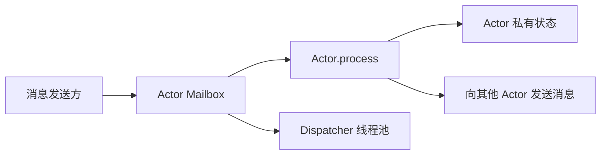
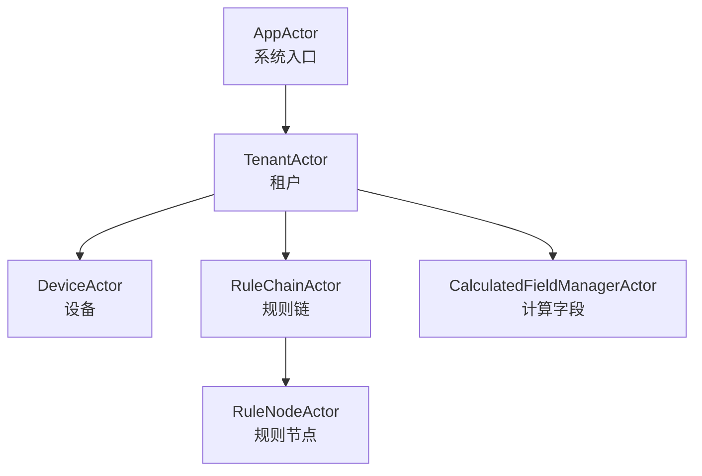
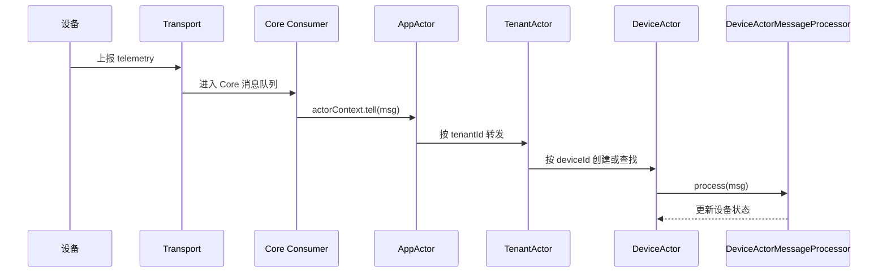
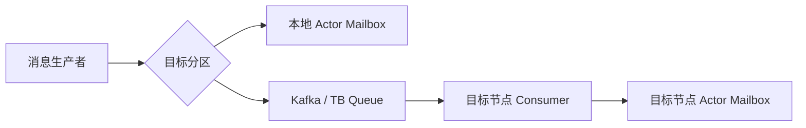

ThingsBoard 的设备消息来自 MQTT、HTTP、CoAP、规则引擎、RPC 和定时任务等多个入口。它们最终可能同时修改同一个设备的会话、RPC 或连接状态。如果直接让多个线程共享这些状态，业务代码就必须到处处理锁、消息顺序和异常隔离。

ThingsBoard 使用 Actor 模式解决这类问题：把设备、租户、规则链等有状态实体封装成独立的 Actor，外部只能向 Actor 发送消息；同一个 Actor 的消息串行处理，不同 Actor 之间则可以并行处理。

本文基于 [ThingsBoard 源码](https://github.com/thingsboard/thingsboard) 中的 `common/actor` 和 `application` 模块进行分析。这里的 Actor 不是跨节点的分布式 Actor，而是“进程内 Actor + 集群消息队列”的组合。



## Actor 模式解决什么问题

传统实现通常是多个线程直接访问共享状态：

```text
多个线程 -> 共享设备状态
              |
        synchronized / Lock
```

在 IoT 系统中，一个设备的消息可能同时来自多个线程：

- 设备上线、下线和心跳；
- 设备上报 telemetry 和 attributes；
- 服务端下发 RPC，以及设备返回 RPC response；
- 设备凭证、名称或 Edge 关系发生变化；
- 定时任务检查 session timeout。

如果这些消息并发修改同一份状态，常见问题包括：

- 消息处理顺序不稳定；
- session 或 RPC 状态发生竞争；
- 大量锁降低吞吐量；
- 一个设备的处理异常扩散到其他设备；
- 业务代码需要重复承担线程安全责任。

Actor 模式将并发控制收敛到消息模型：

```text
消息 -> Actor mailbox -> Actor.process()
```

一个 Actor 通常具有以下特征：

1. Actor 自己拥有状态；
2. 外部通过消息与 Actor 通信；
3. 同一个 Actor 的消息串行处理；普通消息按队列顺序处理，高优先级消息可以提前；
4. 不同 Actor 可以并行处理；
5. Actor 有独立的创建、初始化、停止和异常处理过程。

这种模型适合设备会话、订单、账户、工作流、规则引擎和状态机等“实体状态相对独立”的场景。

它不适合所有问题。没有状态的简单 CRUD、需要跨大量实体强事务一致性的操作，以及纯 CPU 批处理，通常不需要引入 Actor。

## Actor 模式的优点和缺点

### 优点

- **把并发控制收敛到实体边界**：同一个设备、订单或账户的消息进入同一个 mailbox，业务状态通常只由对应 Actor 写入，减少共享状态和锁。
- **天然支持按实体串行、跨实体并行**：单个实体保持处理顺序，不同实体可以交给线程池并行处理，适合设备数量多、实体之间相互独立的系统。
- **故障隔离更清晰**：一个 Actor 的消息处理失败，可以根据策略跳过当前消息、继续消费或停止当前 Actor，不必直接影响整个进程。
- **状态与行为聚合**：实体状态和处理它的业务逻辑放在同一个 Actor 内，业务代码更接近状态机，便于表达连接、超时、RPC 和生命周期变化。
- **适合异步和事件驱动场景**：发送方只需要投递消息，不必直接调用目标对象，也不需要等待目标 Actor 的执行线程。
- **便于水平扩展**：在 ThingsBoard 中，本地 Actor 负责实体内串行，队列和分区负责节点间路由，两层职责比较清晰。

### 缺点

- **单个实体可能成为吞吐瓶颈**：同一个 Actor 一次只能处理一条消息。热点设备处理缓慢时，该设备的后续消息会排队。
- **跨 Actor 事务复杂**：多个 Actor 之间没有天然的原子事务，需要通过消息、幂等、补偿或外部事务机制处理一致性。
- **消息投递和失败处理需要额外设计**：消息可能延迟、重复或在 Actor 停止时未被处理，业务必须明确重试、幂等和失败回调语义。
- **调试链路更长**：一次业务操作可能经过多个 mailbox、dispatcher 和队列，调用栈不能完整反映执行链路，需要日志中的消息 ID、实体 ID 和链路追踪支持。
- **内存状态不是持久状态**：Actor 重启或节点故障后，内存中的状态会丢失或需要重建，关键数据仍要落库或从事件、缓存和队列恢复。
- **模型有额外运行时成本**：每个 Actor 都需要 mailbox、引用和生命周期管理。实体数量巨大时，需要控制 Actor 创建策略、dispatcher 数量和 mailbox 内存。

因此，Actor 模式的核心收益不是“自动提高性能”，而是提供了一个清晰的并发边界。它更适合“状态按实体划分、消息异步到达、实体之间相对独立”的系统；如果业务主要依赖跨实体强事务、全局排序或大规模 CPU 计算，Actor 往往不是最合适的抽象。

## ThingsBoard 为什么选择 Actor 模式

ThingsBoard 面对的不是单一消息入口，而是大量设备同时产生的连接、遥测、属性、RPC、超时和配置变更事件。同一个设备的这些事件可能由不同线程、不同服务甚至不同节点产生，但它们最终都需要修改同一份设备相关状态。

如果使用共享对象加锁，系统需要为大量设备维护锁和并发访问规则，还要处理锁竞争、死锁风险以及消息顺序问题。Actor 模式将问题改写为：

```text
同一个设备 -> 同一个 DeviceActor -> 串行处理
不同设备   -> 不同 DeviceActor -> 并行处理
```

这与 ThingsBoard 的领域边界非常匹配：设备、租户、规则链和规则节点都可以作为相对独立的状态实体。于是 TB 获得了几个直接收益：

- 设备 session、RPC 和事件状态有明确的单一写入者；
- 设备消息的并发控制不需要散落在各个业务方法中；
- 不同设备可以共享 dispatcher 线程池并行处理；
- 设备 Actor 的异常可以按 Actor 粒度处理；
- 本地 Actor 负责实体内串行，TB Queue 和 partition service 负责节点间路由。

这里的重点不是 Actor 让所有消息处理得更快，而是让海量设备的并发边界可管理、可扩展。

## Actor 会成为瓶颈吗

会，但通常是**实体级或资源级瓶颈**，不一定是整个系统的全局瓶颈。

### 1. 热点实体

一个 `DeviceActor` 同一时间只处理一条消息。如果某个设备以极高频率上报数据，或者它的处理逻辑很慢，该设备的 mailbox 会持续积压。这是 Actor 模式有意保留的串行性：不能简单地把同一个设备拆到多个线程，否则又会重新引入状态竞争和顺序问题。

### 2. Dispatcher 饱和

大量 Actor 共享同一个 dispatcher 时，线程池耗尽会导致多个 Actor 的消息都延迟。因此 TB 按职责配置多个 dispatcher，例如 `device-dispatcher`、`tenant-dispatcher` 和 `rule-dispatcher`，减少不同类型 Actor 之间的资源相互影响。但同一个 dispatcher 配置过小，仍然会成为瓶颈。

### 3. Mailbox 积压

Actor 处理速度低于消息到达速度时，消息会在 mailbox 或上游队列中等待，表现为延迟增加、内存增长或消费滞后。`actorThroughput` 可以让 Actor 处理若干条消息后重新调度，避免单个 Actor 长时间占用线程，但它不能提高这个 Actor 的实际处理能力，也不能消除积压。

### 4. 队列分区热点

集群中，实体通常根据 ID 路由到某个队列分区和节点。如果大量热点实体被分配到同一分区，该分区对应的 consumer 或节点可能过载。此时瓶颈在队列分区或节点资源，而不是单个 mailbox。

### 5. Actor 内部的慢操作

如果在 `process()` 中同步执行慢速数据库、网络或外部服务调用，Actor 会在等待期间阻塞该实体后续消息。Actor 不能自动把阻塞 I/O 变成异步 I/O，业务仍需要控制处理时间、使用合适的异步边界，或把耗时工作交给专门的执行资源。

因此，TB 的设计目标不是消除瓶颈，而是把瓶颈定位在可理解的边界上：热点设备影响该设备，dispatcher 饱和影响该类 Actor，队列分区热点影响对应节点。实际运维中应重点观察 mailbox 长度、消息处理耗时、队列 lag、dispatcher 活跃线程数和设备消息延迟。

## ThingsBoard 的 Actor 运行时

ThingsBoard 没有直接使用 [Akka](https://docs.akka.io/)，而是在 `common/actor` 中实现了一套轻量运行时，核心类型如下：

| 类型 | 职责 |
| --- | --- |
| `TbActorSystem` | 创建、查找、发送消息和停止 Actor |
| `TbActor` | 实现 Actor 的初始化、消息处理和销毁逻辑 |
| `TbActorRef` | Actor 的引用，只暴露消息发送能力 |
| `TbActorCtx` | Actor 上下文，提供父子关系、广播和定时发送能力 |
| `TbActorMsg` | Actor 消息 |
| `TbActorMailbox` | 保存消息队列，并调度 Actor 处理消息 |
| `Dispatcher` | 为一组 Actor 提供执行线程池 |

### Actor ID 保证实体唯一

TB 使用实体 ID 作为 Actor ID：

```java
new TbEntityActorId(deviceId)
new TbEntityActorId(tenantId)
new TbEntityActorId(ruleChainId)
new TbEntityActorId(ruleNodeId)
```

`TbEntityActorId` 基于实体 ID 实现 `equals` 和 `hashCode`。`DefaultTbActorSystem` 则通过一个并发 Map 保存 Actor：

```java
ConcurrentMap<TbActorId, TbActorMailbox> actors
```

创建 Actor 时，TB 还会针对同一个 Actor ID 加锁，避免多个线程同时创建出重复实例。源码见 [`DefaultTbActorSystem`](https://github.com/thingsboard/thingsboard/blob/master/common/actor/src/main/java/org/thingsboard/server/actors/DefaultTbActorSystem.java)。

### Mailbox 保证单个 Actor 串行处理

每个 Actor 有自己的 mailbox，内部维护普通消息队列和高优先级消息队列。Mailbox 使用 `busy` 标记保证同一时间只有一个处理任务：

```java
if (busy.compareAndSet(FREE, BUSY)) {
    dispatcher.getExecutor().execute(this::processMailbox);
}
```

因此，同一个设备的消息会形成这样的处理关系：

```text
Device A: A1 -> A2 -> A3，串行
Device B: B1 -> B2，串行

Device A 和 Device B 之间可以并行
```

这不是全局串行。TB 只是把并发控制的粒度缩小到单个实体，避免一个热点设备阻塞所有设备。

### 高优先级消息和吞吐量控制

Mailbox 有两个队列：

```java
private final ConcurrentLinkedQueue<TbActorMsg> highPriorityMsgs;
private final ConcurrentLinkedQueue<TbActorMsg> normalPriorityMsgs;
```

处理消息时优先读取高优先级队列。设备删除、规则节点更新、组件生命周期变化和分区变化等消息，可以优先于普通数据消息处理。

TB 还限制一次连续处理的消息数量。默认配置是：

```yaml
actors:
  system:
    throughput: 5
```

也就是说，一个 Actor 一次最多处理 5 条消息，然后重新提交处理任务。这样可以避免某个高流量设备长期占用 dispatcher，让其他 Actor 获得执行机会。配置见 [`thingsboard.yml`](https://github.com/thingsboard/thingsboard/blob/master/application/src/main/resources/thingsboard.yml)。

### 初始化、异常和销毁

TB Actor 生命周期包括：

```java
init()
process()
destroy()
onInitFailure()
onProcessFailure()
```

初始化失败时，Actor 可以按策略立即重试或延迟重试；超过最大初始化次数后停止。消息处理失败时，Actor 可以选择继续处理后续消息，或者停止自身。

消息还可以实现 `onTbActorStopped()`。当 Actor 停止时，mailbox 中尚未处理的消息会收到停止回调，调用方可以据此释放资源或结束等待。

## ThingsBoard 的 Actor 层级

TB 使用父子关系组织不同类型的实体：

```text
AppActor
├── TenantActor
│   ├── DeviceActor
│   ├── RuleChainActor
│   │   ├── RuleNodeActor
│   │   └── RuleNodeActor
│   └── CalculatedFieldManagerActor

StatsActor（独立的 root actor）
```



`AppActor`、`TenantActor`、`DeviceActor` 和规则链 Actor 之间存在父子关系；`StatsActor` 则是独立的 root actor，不是 `AppActor` 的 child。父子关系不是简单的对象组合，它还用于批量广播、生命周期管理和级联停止。

### AppActor：系统入口

`DefaultActorService` 启动 Actor System，并分别创建 `AppActor` 和 `StatsActor` 两个 root actor，同时注册不同用途的 dispatcher：

- `app-dispatcher`：系统入口；
- `tenant-dispatcher`：租户 Actor；
- `device-dispatcher`：设备 Actor；
- `rule-dispatcher`：规则链和规则节点 Actor；
- `cf-manager-dispatcher`：Calculated Field 管理 Actor；
- `cf-entity-dispatcher`：Calculated Field 实体 Actor。

`AppActor` 根据消息类型完成第一层路由：

- 设备消息转发给租户 Actor；
- 规则引擎队列消息转发给租户 Actor；
- 分区变化广播给子 Actor；
- session timeout 广播给租户 Actor；
- 组件生命周期事件转发给对应租户。

入口代码见 [`AppActor`](https://github.com/thingsboard/thingsboard/blob/master/application/src/main/java/org/thingsboard/server/actors/app/AppActor.java)。

### TenantActor：租户级路由和生命周期管理

每个租户对应一个 `TenantActor`。它负责管理租户范围内的设备、规则链和 Calculated Field Actor。

设备 Actor 是按需创建的：

```java
ctx.getOrCreateChildActor(
        new TbEntityActorId(deviceId),
        () -> DefaultActorService.DEVICE_DISPATCHER_NAME,
        () -> new DeviceActorCreator(systemContext, tenantId, deviceId),
        () -> true);
```

这意味着 TB 不需要在启动时为每个设备创建一个完整 Java 对象，而是由消息触发懒加载。租户 Actor 还会在租户被删除或分区发生变化时停止不再属于当前节点的子 Actor。

## 各类 Actor 的配置参数

ThingsBoard 不会为每个 `DeviceActor` 单独创建线程池，也没有为每个 Actor 配置一组独立参数。配置主要分为三层：

1. **Actor System 参数**：控制所有 Actor 的 mailbox、初始化和调度行为；
2. **Dispatcher 参数**：按 Actor 类型配置共享线程池；
3. **业务参数**：控制设备 session、RPC、规则引擎和统计等 Actor 相关行为。

配置位于 `application/src/main/resources/thingsboard.yml` 的 `actors` 节点，环境变量可以覆盖默认值。

### Actor 类型与 Dispatcher

当前源码中的主要映射关系如下：

| Actor 或 Actor 层级 | Dispatcher | 默认线程数 | 作用 |
| --- | --- | ---: | --- |
| `AppActor` | `app-dispatcher` | 1 | 系统入口、初始化和全局消息路由 |
| `StatsActor` | `tenant-dispatcher` | 2 | 统计消息处理；它是独立 root actor |
| `TenantActor` | `tenant-dispatcher` | 2 | 租户级路由和子 Actor 管理 |
| `DeviceActor` | `device-dispatcher` | 4 | 设备 session、属性、遥测和 RPC |
| `RuleChainActor`、`RuleNodeActor` | `rule-dispatcher` | 8 | 规则链和规则节点处理 |
| Calculated Field manager Actor | `cf-manager-dispatcher` | 2 | Calculated Field 管理 |
| Calculated Field entity Actor | `cf-entity-dispatcher` | 8 | Calculated Field 实体计算 |

对应配置示例：

```yaml
actors:
  system:
    app_dispatcher_pool_size: 1
    tenant_dispatcher_pool_size: 2
    device_dispatcher_pool_size: 4
    rule_dispatcher_pool_size: 8
    cfm_dispatcher_pool_size: 2
    cfe_dispatcher_pool_size: 8
```

线程池大小是同一类型 Actor 的共享并发额度。例如 `device_dispatcher_pool_size: 4` 表示设备 Actor 共享一个大小为 4 的 dispatcher，并不表示每个设备 Actor 都拥有 4 个线程。配置为 `0` 时，当前实现会使用 `max(1, CPU 核数 / 2)`；配置为 `1` 时使用单线程执行器，大于 `1` 时使用工作窃取线程池。

`edge_dispatcher_pool_size` 在部分版本的 `thingsboard.yml` 中仍然存在，但需要结合对应版本的 `DefaultActorService` 检查是否实际创建和使用。当前源码的 `DefaultActorService` 创建的是 app、tenant、device、rule、Calculated Field manager 和 Calculated Field entity 这六类 dispatcher，不能仅凭配置项就断定 Edge Actor 使用了独立线程池。

### Actor System 通用参数

```yaml
actors:
  system:
    throughput: 5
    scheduler_pool_size: 1
    max_actor_init_attempts: 10
```

| 参数 | 默认值 | 含义 |
| --- | ---: | --- |
| `throughput` | 5 | 一个 Actor 连续处理的最大消息数，达到后重新调度其他 Actor |
| `scheduler_pool_size` | 1 | Actor 定时任务调度线程池大小 |
| `max_actor_init_attempts` | 10 | Actor 初始化最大尝试次数，超过后停止 Actor |

`throughput` 是调度公平性参数，不是单个 Actor 的并发数。一个 Actor 仍然不会同时处理多条消息；该值越大，单个繁忙 Actor 的批处理效率可能越高，但其他 Actor 可能等待更久。

### Tenant、Device 和 Session 相关参数

```yaml
actors:
  tenant:
    create_components_on_init: true
  session:
    max_concurrent_sessions_per_device: 1
    sync:
      timeout: 10000
```

- `tenant.create_components_on_init`：Tenant Actor 初始化时是否创建租户范围内的组件。
- `session.max_concurrent_sessions_per_device`：单个设备允许的最大并发 session 数，默认是 1。它是设备 session 业务约束，不是 `device-dispatcher` 的线程数。
- `session.sync.timeout`：同步 session 请求的默认超时时间，单位为毫秒。

### Rule Actor 相关参数

`RuleChainActor` 和 `RuleNodeActor` 使用 `rule-dispatcher`，但规则处理中的数据库回调、邮件、短信和外部调用通常使用独立线程池：

```yaml
actors:
  rule:
    db_callback_thread_pool_size: 50
    mail_thread_pool_size: 40
    sms_thread_pool_size: 50
    external_call_thread_pool_size: 50
    chain:
      error_persist_frequency: 3000
    node:
      error_persist_frequency: 3000
```

这些参数不是 Rule Actor mailbox 的并发数，而是规则业务调用的外围资源。比如增大 `rule_dispatcher_pool_size` 并不会自动解决外部 HTTP 调用线程池不足的问题。

### RPC、统计和 Calculated Field 参数

```yaml
actors:
  rpc:
    max_retries: 5
    submit_strategy: BURST
    response_timeout_ms: 30000
    close_session_on_rpc_delivery_timeout: false
  statistics:
    enabled: true
    persist_frequency: 3600000
  calculated_fields:
    calculation_timeout: 5
```

- `rpc.max_retries`：RPC 投递失败时的最大持久化重试次数。
- `rpc.submit_strategy`：RPC 提交策略，可选 `BURST`、`SEQUENTIAL_ON_ACK_FROM_DEVICE` 和 `SEQUENTIAL_ON_RESPONSE_FROM_DEVICE`。
- `rpc.response_timeout_ms`：按设备响应顺序提交 RPC 时等待响应的时间，单位为毫秒。
- `rpc.close_session_on_rpc_delivery_timeout`：RPC 投递超时时是否关闭 transport session。
- `statistics.enabled` 和 `statistics.persist_frequency`：是否启用 Actor 统计及统计持久化周期，单位为毫秒。
- `calculated_fields.calculation_timeout`：Calculated Field 等待计算结果的超时时间，单位为秒。

### 配置调优时的边界

这些参数不能脱离监控单独调大：

- 设备消息延迟高，先区分是 `device-dispatcher` 线程不足、单个热点设备积压，还是数据库或队列变慢；
- 规则处理慢，区分 `rule-dispatcher` 饱和与外部调用线程池不足；
- 提高 `throughput` 只能改变 Actor 之间的调度批次，不能提高单个设备的并行处理能力；
- 提高 dispatcher 线程数会增加并发和资源消耗，也可能把压力转移到数据库、队列或外部服务；
- `max_actor_init_attempts` 影响初始化失败后的存活时间，不是消息重试次数。

### DeviceActor：设备状态的串行边界

`DeviceActor` 是 TB 使用 Actor 模式最典型的地方。它处理：

- transport 上报消息；
- attributes 更新；
- credentials 更新；
- 设备删除；
- 服务端 RPC 请求和响应；
- RPC 超时和移除；
- session timeout；
- Edge 相关更新。

`DeviceActor` 本身主要按 `MsgType` 分发消息，具体业务由 `DeviceActorMessageProcessor` 完成：

```java
switch (msg.getMsgType()) {
    case TRANSPORT_TO_DEVICE_ACTOR_MSG:
        processor.process((TransportToDeviceActorMsgWrapper) msg);
        break;
    case DEVICE_RPC_REQUEST_TO_DEVICE_ACTOR_MSG:
        processor.processRpcRequest(ctx, (ToDeviceRpcRequestActorMsg) msg);
        break;
    case DEVICE_ACTOR_SERVER_SIDE_RPC_TIMEOUT_MSG:
        processor.processServerSideRpcTimeout((DeviceActorServerSideRpcTimeoutMsg) msg);
        break;
}
```

同一个设备的 session、RPC 和设备事件因此都经过同一个 mailbox，避免多个入口同时修改设备状态。

### RuleChainActor 和 RuleNodeActor：规则引擎的 Actor 化

规则引擎进一步按照规则链和规则节点拆分：

- 一条规则链对应一个 `RuleChainActor`；
- 规则链中的规则节点对应一个 `RuleNodeActor`；
- 规则链 Actor 负责加载节点、建立路由和处理规则链级事件；
- 规则节点 Actor 负责处理进入该节点的 `TbMsg`。

规则链初始化时，TB 会读取规则节点并创建对应的子 Actor。规则链更新时，新增节点会创建 Actor，删除节点会停止 Actor，已有节点则收到高优先级更新消息。

规则链内部的消息传递大致是：

```text
RuleChainActor -> RuleNodeActor
RuleNodeActor  -> RuleNodeActor
RuleNodeActor  -> RuleChainActor
```

这使得规则节点可以拥有自己的处理状态和失败边界，同时保留规则链对拓扑和生命周期的管理能力。

## 一条设备消息如何流转

以设备上报数据为例，整体路径如下：

```text
MQTT / HTTP / CoAP
        |
        v
Core Queue Consumer
        |
        v
AppActor
        |
        v
TenantActor
        |
        v
DeviceActor
        |
        v
DeviceActorMessageProcessor
```



Core consumer 会将消息包装成 `TransportToDeviceActorMsgWrapper`，然后发送给 `ActorSystemContext`：

```java
actorContext.tell(
    new TransportToDeviceActorMsgWrapper(toDeviceActorMsg, callback));
```

`ActorSystemContext.tell()` 实际上会把消息发送给 `AppActor`：

```java
public void tell(TbActorMsg msg) {
    appActor.tell(msg);
}
```

之后依次发生：

1. `AppActor` 从消息中取得 `tenantId`；
2. 查找或创建对应的 `TenantActor`；
3. `TenantActor` 从消息中取得 `deviceId`；
4. 查找或创建对应的 `DeviceActor`；
5. `DeviceActor` 将消息交给 `DeviceActorMessageProcessor`；
6. mailbox 保证该设备的消息串行执行。

## Actor 与集群队列的边界

这里最容易产生误解：TB 的 Actor 不是跨节点的分布式 Actor。

TB 的 Actor 主要存在于单个 JVM 内存中。多个 TB 节点之间的消息转发，由 Kafka 或其他 TB Queue，以及 partition service 完成：

```text
目标实体属于当前节点
    -> 直接发送给本地 Actor

目标实体属于其他节点
    -> 写入对应队列分区
    -> 目标节点消费消息
    -> 目标节点创建或找到本地 Actor
```

规则引擎的代码体现了这个边界：如果目标分区属于当前节点，就直接调用本地 Actor；否则就将消息写入规则引擎队列。

因此 TB 实际使用的是两层模型：

```text
JVM 内部：Actor 保证实体级串行和状态隔离
节点之间：Queue 保证消息传输、分区和水平扩展
```



Actor ID 只在本地 Actor System 中定位 Actor，不能直接用它跨节点寻址。

## 这个设计的取舍

TB 的实现没有引入完整的 Actor 框架，而是只实现自身需要的能力：mailbox、dispatcher、父子关系、优先级、生命周期、重试和停止回调。

这样做的好处是：

- 依赖少，运行时结构容易控制；
- 能针对设备和规则引擎定制消息类型；
- 可以直接结合 TB 现有的队列分区机制；
- 单个实体的状态边界清晰；
- 不同实体可以通过不同 dispatcher 隔离资源。

代价也很明确：

- Actor 状态主要在内存中，节点重启后需要重新初始化；
- mailbox 默认不是持久化队列；
- 跨节点消息不能直接依赖本地 `TbActorRef`；
- 业务代码必须正确决定消息优先级、分区和失败回调；
- 某个实体的消息处理过慢，仍然会阻塞该实体自己的后续消息。

所以，Actor 并没有消除所有一致性和可靠性问题。它主要解决的是“同一实体内部如何安全并发处理状态”，而消息持久化、跨节点路由和故障恢复仍然由队列、分区服务和业务回调负责。

## 配套 Demo

我另外创建了一个 [thingsboard-actor-demo](https://github.com/zhijunio/thingsboard-demos/tree/main/thingsboard-actor-demo)，将 ThingsBoard `common/actor` 中与示例相关的核心实现复制到独立 Maven 工程，做了一个最小可运行示例。

这个 Demo 不依赖完整的 ThingsBoard 服务，重点演示 Actor runtime 本身的行为：

- 创建 root actor 和 child actor；
- 通过 `TbActorMsg` 发送普通消息和高优先级消息；
- Actor 初始化失败后的延迟重试；
- 消息处理异常后的恢复策略；
- 同一个 Actor 的消息串行处理；
- 父 Actor 停止时级联停止 child actor；
- Actor 停止后通知队列中未处理的消息。

运行测试：

```bash
mvn test
```

运行示例程序：

```bash
mvn compile exec:java \
  -Dexec.mainClass=org.example.thingsboard.actordemo.ActorDemo
```

示例入口是 `ActorDemo`，测试用例则对应验证初始化重试、串行处理和停止回调等行为。阅读 TB 源码时，可以先从这个 Demo 理解 `TbActorSystem`、`TbActorRef`、`TbActorMsg` 和 `TbActorMailbox` 的关系，再回到 `AppActor`、`TenantActor` 和 `DeviceActor`。

## 从 Demo 看 Actor 的执行原理

### 1. Actor System 只负责管理，不负责业务

`ActorDemo.main()` 首先创建 Actor System 和 dispatcher：

```java
TbActorSystem actorSystem = new DefaultTbActorSystem(
        new TbActorSystemSettings(2, 1, 5));
ExecutorService dispatcher = Executors.newFixedThreadPool(2);
actorSystem.createDispatcher("demo-dispatcher", dispatcher);
```

`TbActorSystemSettings(2, 1, 5)` 的三个参数分别是：

- `actorThroughput = 2`：一个 Actor 一次最多处理 2 条消息；
- `schedulerPoolSize = 1`：定时任务线程池大小；
- `maxActorInitAttempts = 5`：初始化最大尝试次数。

dispatcher 只是执行任务的线程池，不包含具体业务。业务逻辑由 `DemoActor` 实现，因此多个 Actor 可以共享一个 dispatcher，而每个 Actor 仍然有自己的 mailbox。

### 2. Creator 把“Actor 身份”和“Actor 实例”分开

`DemoActorCreator` 实现 `TbActorCreator`：

```java
@Override
public TbActorId createActorId() {
    return actorId;
}

@Override
public TbActor createActor() {
    return new DemoActor(deviceState, metrics, failuresBeforeReady);
}
```

创建过程先询问 `createActorId()`，再调用 `createActor()`。这对应 TB 中的实体 Actor：先通过设备 ID、租户 ID 或规则链 ID 定位唯一 Actor，再决定如何构造它。

Demo 创建了一个 root actor 和一个 child actor：

```java
TbActorRef root = actorSystem.createRootActor(
        "demo-dispatcher", new DemoActorCreator("demo-root", deviceState, state, 1));
TbActorRef child = actorSystem.createChildActor(
        "demo-dispatcher",
        new DemoActorCreator("demo-device-1", childDeviceState, childState, 0),
        root.getActorId());
```

在 `DefaultTbActorSystem.createActor()` 中，TB 会检查 Actor ID 是否已经注册；如果没有，就创建 `DemoActor`、创建 `TbActorMailbox`、登记到 `actors` Map，并记录父子关系。真正的 `init()` 由 dispatcher 异步执行。

### 3. Mailbox 是 Actor 串行化的关键

`TbActorRef` 对外只暴露发送消息的能力：

```java
root.tell(DemoMessage.connect("session-1"));
root.tell(DemoMessage.telemetry("temperature", 21.5));
```

调用 `tell()` 并不会直接调用 `DemoActor.process()`，而是先把消息放入 `TbActorMailbox`。Mailbox 再通过 `busy` 状态保证同一个 Actor 只有一个 `processMailbox` 任务在运行：

```java
if (busy.compareAndSet(FREE, BUSY)) {
    dispatcher.getExecutor().execute(this::processMailbox);
}
```

这解释了 Demo 测试中的断言：

```java
assertEquals(1, state.maxConcurrent());
```

dispatcher 使用了两个线程，但 root actor 的 `maxConcurrent` 仍然是 1。线程池可以并行执行不同 Actor，不能并行执行同一个 Actor 的 `process()`。

### 4. Actor 尚未 ready 时，消息会先进入 mailbox

root actor 被配置为初始化失败一次：

```java
new DemoActorCreator("demo-root", new DeviceState(), state, 1)
```

`DemoActor.init()` 第一次执行时抛出异常，`onInitFailure()` 返回：

```java
return InitFailureStrategy.retryWithDelay(20);
```

这 20 毫秒期间，主线程已经可以调用 `root.tell()`。消息会先进入 mailbox，但因为 Actor 还没有 `ready`，不会立即处理。初始化成功后，mailbox 再开始消费队列。

这个行为很重要：创建 Actor 和 Actor 可处理消息是两个阶段，调用方不需要自己等待初始化完成。但这不等于消息具有持久化保障；如果初始化最终失败并停止，队列中的消息会收到停止回调，而不会被业务处理。

### 5. 优先级只影响 mailbox 取消息的顺序

Demo 同时发送普通消息和高优先级消息：

```java
root.tell(DemoMessage.connect("session-1"));
root.tell(DemoMessage.telemetry("temperature", 21.5));
root.tellWithHighPriority(DemoMessage.rpcRequest("reboot", "{}"));
```

`TbActorMailbox.processMailbox()` 每次取消息时先检查高优先级队列，再检查普通队列。因此当 mailbox 开始下一次取消息时，RPC 请求会优先于普通消息处理。

但优先级不是全局调度，也不能抢占已经开始执行的普通消息。它只影响当前 Actor mailbox 的下一次取消息顺序；也不是持久化队列。如果业务需要跨节点的顺序和可靠投递，仍然要依赖 TB Queue 和分区策略。

### 6. DemoActor 如何体现业务逻辑

Demo 不是让 Actor 只记录一个整数，而是把它建模为一个简化的设备 Actor。`DemoMessage` 按业务语义区分连接、遥测、RPC 和失败消息：

```java
root.tell(DemoMessage.connect("session-1"));
root.tell(DemoMessage.telemetry("temperature", 21.5));
root.tellWithHighPriority(DemoMessage.rpcRequest("reboot", "{}"));
```

`DemoActor.process()` 将消息转换成对 `DeviceState` 的状态变更：

```java
switch (demoMessage.type()) {
    case CONNECT -> deviceState.connect(demoMessage.value());
    case TELEMETRY -> deviceState.updateTelemetry(
            demoMessage.value(), demoMessage.numericValue());
    case RPC_REQUEST -> deviceState.recordRpc(
            demoMessage.value(), demoMessage.params());
    case FAIL -> throw new IllegalStateException("demo process failure");
}
```

这里的业务含义是：连接消息更新当前 session，遥测消息更新设备的 telemetry，RPC 消息记录最近一次服务端请求。`DeviceState` 只由这个 `DemoActor` 写入，因此这些字段不需要用锁保护；主程序在消息处理完成后读取它们，输出最终设备状态。这正是“一个实体一个 Actor”的价值：消息串行化不仅约束执行顺序，也给设备状态划定了唯一写入边界。

Demo 另外发送一条失败消息，用来验证异常策略：

```java
root.tell(DemoMessage.failure());
```

`DemoActor.process()` 抛出异常后，异常不会从 dispatcher 线程直接向调用方传播。Mailbox 捕获异常并调用：

```java
ProcessFailureStrategy strategy = actor.onProcessFailure(msg, t);
```

Demo 返回 `ProcessFailureStrategy.resume()`，所以失败消息被记录后，后续消息仍然可以继续处理。测试验证了：

```java
assertEquals(1, state.processFailures());
assertEquals(2, state.processedTypes().size());
```

如果 Actor 返回 `ProcessFailureStrategy.stop()`，runtime 则会停止该 Actor。

### 7. 父子关系支持广播和级联停止

Demo 通过系统向 root actor 的所有子 Actor 广播消息：

```java
actorSystem.broadcastToChildren(
        root.getActorId(), DemoMessage.telemetry("broadcast", 1));
```

child actor 收到消息后，会把 `broadcast=1` 写入自己的 `DeviceState`；`DemoState` 只记录它收到过哪类消息。TB 在实际应用中用相同机制向租户下的设备 Actor、规则链 Actor 广播分区变化或 session timeout。

停止 root actor 时，系统会先递归停止它的子 Actor：

```java
actorSystem.stop(root);
```

随后 mailbox 调用 `DemoActor.destroy()`，并清理尚未处理的消息。`DemoMessage.onTbActorStopped()` 可以收到停止原因，用于执行调用方的清理或回调逻辑。

### 8. DemoState 不是 Actor 的共享业务状态

Demo 中的 `DemoState` 使用了 `AtomicInteger`、`AtomicReference` 和 `CopyOnWriteArrayList`，容易让人误以为 Actor 仍然依赖共享并发容器。

实际上，`DemoState` 是测试观测器：主线程需要读取处理结果，dispatcher 线程负责写入统计数据，所以它必须具备跨线程可见性。真正的 Actor 业务状态应当放在 `DemoActor` 实例内部，并只在 `process()`、`init()` 和 `destroy()` 中访问。TB 的设计目标正是让这部分业务状态不需要额外加锁。

## Demo 与 TB 实际代码的对应关系

| Demo | ThingsBoard |
| --- | --- |
| `DemoActor` | `DeviceActor`、`TenantActor`、`RuleChainActor` |
| `DemoMessage` | `TransportToDeviceActorMsgWrapper`、`QueueToRuleEngineMsg` 等 `TbActorMsg` |
| `DemoActorCreator` | `DeviceActorCreator`、`RuleChainActor.ActorCreator` |
| `demo-dispatcher` | `device-dispatcher`、`tenant-dispatcher`、`rule-dispatcher` |
| `DeviceState` | `DeviceActor` 内部维护的 session、telemetry、RPC 等设备状态 |
| `DemoState` | Demo 的测试观测器，用于记录消息类型、并发数、失败次数和停止原因 |
| root/child actor | `AppActor` -> `TenantActor` -> `DeviceActor` |

因此，这个 Demo 虽然没有接入 MQTT、Kafka 或数据库，但已经复现了 TB Actor runtime 的核心机制：唯一身份、异步初始化、mailbox 排队、单 Actor 串行、跨 Actor 并行、优先级、失败策略和生命周期管理。

## 总结

ThingsBoard 的 Actor 模式可以概括为：

1. 用实体 ID 保证一个实体对应一个本地 Actor；
2. 用 mailbox 保证同一个实体的消息串行处理；
3. 用 dispatcher 让不同实体并行处理；
4. 用父子 Actor 组织 App、Tenant、Device 和 Rule Chain 的生命周期；
5. 用优先级和吞吐量控制处理公平性；
6. 用队列和分区服务完成跨节点通信。

它的核心价值不是抽象出一套新的线程模型，而是把并发控制从共享状态和锁，转化为“按实体排队、按实体串行、跨实体并行”的消息处理模型。这正是 IoT 平台处理海量设备状态时需要的并发边界。
