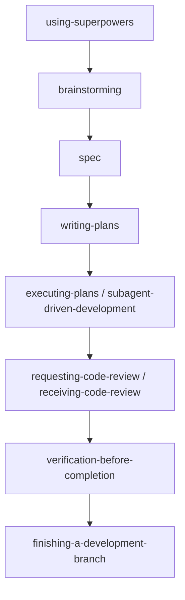

前两篇写了 agent-skills 和 GSD。这篇轮到 Superpowers。

如果你已经装过它，过一阵多半会冒出一个感觉：

**这东西怎么老想先拦我一下。**

你刚想直接写代码，它让你先 brainstorming。  
你刚想开工，它让你先出 spec。  
你刚想说差不多好了，它又要你先验证、先 review。

刚开始会觉得烦。用久了会发现，它拦的地方，往往正是最容易写偏的地方。

我现在越来越觉得，很多 AI 工具的问题，不在“会不会写”，而在“每次都像重新开始”。

- 上一轮说过要先写测试，这一轮忘了
- 上一轮说过改完要 review，这一轮又直接宣布完成
- 上一轮说过不要一次改太多文件，这一轮还是把半个项目一起改了

你当然可以每次重新写一遍约束。问题是，写得越多，后面越容易散掉。

Superpowers 抓得很准的，就是这个问题。

它不想靠越来越长的 prompt 反复提醒模型，而是想先把做事顺序排好。

<!--more-->

## 一、它到底想解决什么问题

Superpowers 背后的判断其实很直接：

> 单靠一段长 prompt，不足以稳定约束模型。

因为 prompt 更像提醒，不像护栏。它能影响模型，但很难稳稳管住模型下一步必须做什么。

今天的大模型，最常见的失控方式不是“完全不会”，而是这种半对半错的推进：

- 太快进入实现
- 跳过需求澄清
- 没 spec 就开始写代码
- 没验证就说完成
- 没搞清根因就直接修 bug

Superpowers 没继续在 prompt 上加码，而是把这些规则拆成一道道门槛。

也就是说，它不只是嘴上说：

- “最好先写测试”
- “最好先 review”
- “最好先验证”

它想做的是，把这些“最好”变成“先过这一关，才能走下一步”。

这就是它和很多普通技能仓库最大的区别。

## 二、Superpowers 到底是什么

如果只看表面，Superpowers 当然也是一组 skills。

但如果只把它理解成“又一套技能集合”，其实会把它看小了。

它更像一套开发流程。  
skill 只是外壳，核心是：

- 先判断应该走什么流程
- 先出设计
- 再写计划
- 再执行
- 再审查
- 再验证
- 最后再收尾

所以它和 `mattpocock/skills` 的一个明显差别是：

- `mattpocock/skills` 更像一组窄 skill，你按场景点着用
- Superpowers 更像一条总流程，会把你拉进一整套施工顺序里

如果换成人话：

`mattpocock/skills` 更像一排顺手工具。  
Superpowers 更像你先得接受的一套干活规矩。

## 三、它为什么要这样设计

我觉得这篇最值得讲的，不是哪几个 skill，而是它为什么非得把这些门槛插在这里。

### 1. 为什么强制先做 skill check

Superpowers 里 `using-superpowers` 的姿态很硬。

它要求的不是“如果你想起有 skill 可以用，就用一下”，而是：

> 只要有 1% 的可能相关，就先检查 skill。

这背后的逻辑很简单：  
模型最容易做错的，不是某一步，而是一上来就用错了整套工作方式。

如果一开始就没有进对流程，后面往往越做越偏。

### 2. 为什么强制先 brainstorming

Superpowers 很看重 `brainstorming`。

不是因为它喜欢多开会，而是因为它默认认为：

**很多实现问题，其实是前面的定义问题。**

你说“做个登录功能”，它不会立刻去写接口，而是先问：

- 密码还是无密码
- 要不要 OAuth
- 注册和登录是不是一套流
- 成功标准是什么

这个设计看起来慢，但它解决的是一个很现实的问题：

AI 特别擅长替你补空白。  
而一旦前面的空白靠猜补上，后面所有实现都可能建在错的前提上。

### 3. 为什么强制写 spec 和 plan

Superpowers 不满足于“讨论清楚了”。

它会继续把确认下来的东西写成文档，再把文档拆成计划。

这一步的意义是：

- 把讨论从口头状态，变成可复查状态
- 把需求从整体愿望，变成执行切片
- 把 agent 从“边想边写”，拉回“先想后做”

这也是为什么我不太把它看成一组普通 slash command。

它想固定的不是某个动作，而是动作之间的顺序。

### 4. 为什么强制 verification、review、finish

很多 agent 在“代码写完”这一刻最容易撒手。

Superpowers 不接受这一点。

它明确要求：

- 改完要验证
- 验证要跑命令
- 该 review 的要 review
- 最后要做 branch 收尾

这不是形式整齐，而是在堵最常见的工程漏洞：

- “我觉得应该可以”
- “理论上没问题”
- “先这样吧，回头再看”

Superpowers 的立场是：  
**没有验证，不算完成。**

## 四、它实际是怎么运转的

如果只听别人介绍，很容易把 Superpowers 想成一种“说一句需求，它就自动把整条链跑完”的系统。

这不准确。

我更愿意把它理解成一套带护栏的驾驶系统，不是自动驾驶。

你当然还是在开车，但它会不断拦你：

- 先别写代码，先做 brainstorming
- 先别开工，先把设计写下来
- 先别直接改，先写计划
- 先别宣布完成，先验证

整条链路大致是这样：



这张图里最重要的不是节点名，而是顺序。

Superpowers 想做的，是把“想到什么就直接做什么”的工作方式，改成“每一步都先过一道门”。

这也是为什么它比很多技能仓库都重。  
它想管的不是某个局部动作，而是从设计到收尾这一整段。

## 五、关键技能不要逐个背，要按角色看

这套插件当前本机可见的主要技能是 14 个。  
但比起逐个背名字，更有用的是按角色去理解。

### 1. 入口和总开关

- `using-superpowers`

这个 skill 很像总调度入口。  
它要求先判断 skill 是否适用，再决定走哪条流程。

### 2. 设计与规划

- `brainstorming`
- `writing-plans`

这组技能解决的是：  
**别把模糊想法直接变成代码。**

一个负责把问题问清楚、收成 spec。  
一个负责把 spec 拆成能执行的计划。

### 3. 执行

- `executing-plans`
- `subagent-driven-development`
- `dispatching-parallel-agents`

这组技能不是在决定“做什么”，而是在决定“执行怎么往前推”。

它们更关注：

- 当前任务怎么拆
- 要不要分 subagent
- 哪些任务能并发
- 执行到哪里该停下来复核

### 4. 调试与测试

- `systematic-debugging`
- `test-driven-development`

这组技能负责两个最容易乱来的环节：

- 遇到 bug 时别拍脑袋修
- 写功能时别跳过测试

尤其 `systematic-debugging`，它不是一句“先找根因”那么简单。

它要求的是一整套顺序：

- 先做根因调查
- 再看模式
- 再形成假设
- 再做最小验证
- 最后才进入修复

这个比“出了 bug 就直接改”要慢一点，但会稳很多。

### 5. 质量与收尾

- `requesting-code-review`
- `receiving-code-review`
- `verification-before-completion`
- `finishing-a-development-branch`
- `using-git-worktrees`

这组技能解决的是最后一公里问题。

很多 AI 流程在“代码写出来”这里就结束了。  
Superpowers 不是。

它还会继续盯：

- 代码有没有 review
- 结果有没有验证
- 分支怎么收尾
- 工作区怎么隔离

所以你可以把它理解成：

**它不只关心开发，还关心开发之后怎么收。**

## 六、和 `mattpocock/skills`、GSD 到底怎么选

这三套东西常被放在一起说，但它们的重心并不一样。

### 1. 和 `mattpocock/skills` 比

`mattpocock/skills` 更像一组窄 skill。

它的特点是：

- 粒度更小
- 更轻
- 更适合按场景点名调用

比如：

- 需求没清楚，就用 `grill-me`
- 想测试驱动，就用 `tdd`
- 遇到 bug，就用 `diagnose`

Superpowers 则不是“按场景掏一个工具”这么简单。

它更像一套总控规则。  
它不只告诉你“这一步怎么做”，还会继续往后推：“下一步该做什么”。

所以如果说：

- `mattpocock/skills` 像一排专用螺丝刀
- Superpowers 就更像一整套施工制度

### 2. 和 GSD 比

GSD 更偏项目管理和推进节奏。

它适合的是：

- 一个项目怎么立起来
- 阶段怎么分
- 需求怎么追踪
- 长周期任务怎么推进

Superpowers 更偏开发过程纪律。

它更关注的是：

- 当前这个需求怎么从讨论走到交付
- 当前这段代码怎么从 spec 走到 review
- 当前这个 bug 怎么按流程排查

所以两者并不在一个层面上打架。

GSD 更像项目层。  
Superpowers 更像开发链路层。

### 3. 什么时候用哪一个

如果你的问题是：

- 某个环节不稳
- 需求常常没问清楚
- 测试和排障总是乱

那先上 `mattpocock/skills` 会更轻、更顺手。

如果你的问题是：

- 整个开发过程都想规范起来
- 想把 brainstorming、spec、plan、implementation、review、verification 串起来
- 不想每次都重新提醒 agent 做事顺序

那 Superpowers 更合适。

如果你的问题是：

- 项目本身更大
- 阶段更多
- 你关心的不只是写代码，而是整个项目推进

那 GSD 会更对口。

一句话收：

- `mattpocock/skills`：补局部动作
- Superpowers：管整条开发链
- GSD：管更大一层的项目推进

## 七、安装和落地提醒

如果只是试用，先看你所在工具有没有现成插件入口。

Claude Code 官方市场：

```bash
/plugin install superpowers@claude-plugins-official
```

Superpowers 自有市场：

```bash
/plugin marketplace add obra/superpowers-marketplace
/plugin install superpowers@superpowers-marketplace
```

其他平台通常也有各自入口，比如：

- Codex CLI：`/plugins`
- Codex App：Sidebar → Plugins → Coding
- Cursor：`/add-plugin superpowers`
- Gemini CLI：`gemini extensions install https://github.com/obra/superpowers`

中文用户还有社区维护的 [superpowers-zh](https://github.com/jnMetaCode/superpowers-zh)。

不过如果这篇只留一个提醒，我会留这句：

**安装不是重点，宿主是不是真的按这套 skill 流程接管执行，才是重点。**

## 八、局限

Superpowers 的问题不是没用，而是它真的偏重。

### 1. 对小需求来说可能太重

“帮我看一段代码”这种事，真走完整条链，有时会显得用力过猛。

### 2. 它牺牲了一部分灵活性

你如果本来就习惯自己控制节奏，可能会觉得它管得太多。

### 3. token 成本通常更高

subagent、review、verification 这些环节一旦都走起来，成本自然会高过单线程自由对话。

### 4. 它假设你的目标是“认真做软件”

如果只是临时问一句、改一行、做个很轻的小实验，它未必是最顺手的选择。

## 九、延伸阅读

如果你想把相关框架放在一起看，可以继续读：

- [Agent Skills：给 AI 编程助手装上一套靠谱的工程化工作流](/posts/agent-skills-install-and-usage-guide/)
- [GSD：让 AI 不再写到一半就忘了的项目管理框架](/posts/gsd-get-shit-done-project-framework/)
- [mattpocock/skills：安装、使用与快速上手示例](/posts/mattpocock-skills-guide/)

## 十、最后

很多人调 AI 的方式，是不断往 prompt 里补规则。

“先写测试再写代码”“改完要 review”“不要一次改太多文件”——每次新对话，都再提醒一遍。

我觉得 Superpowers 真正提供的是另一种思路：

不是继续加长 prompt，而是把开发过程写成固定步骤，让模型每次都从同一套顺序重新进入。

所以它真正想解决的，不是“模型不会写”，而是：

**模型每次都像从头开始。**
