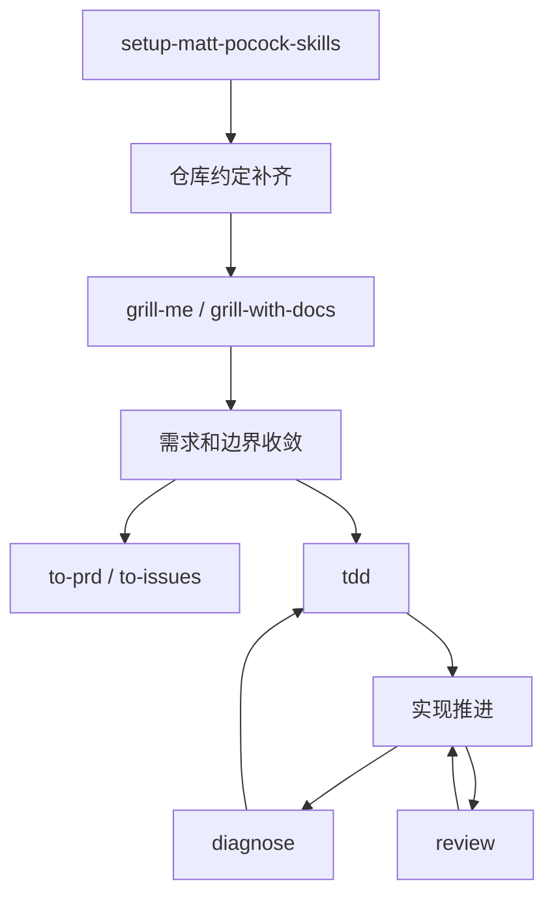

如果你已经在用 Claude Code、Codex 或其他支持 Skills 的 AI 编程助手，很容易遇到一个共同问题：

模型知道很多，但做事不稳。

它也许能直接吐出一段代码，但常常会跳过几个真正值钱的步骤：需求没问清楚，测试没先写，bug 没复现，项目上下文没补齐，就已经开始“自信实现”了。

`mattpocock/skills` 值得看的地方，不是它又发明了一套新 prompt，而是它试图解决这个更根本的问题：

**怎么让 AI 助手按工程流程做事，而不是按冲动做事。**

<!--more-->

## 一、它到底在拦什么

很多人第一次接触 Skills，会把它理解成：

- 一组可复用 prompt
- 一堆 slash command
- 或者某种“更高级的 AI 插件”

这些都不算错，但都没打中重点。

`mattpocock/skills` 真正在做的，是把一组资深工程师本来就会遵守的做事顺序，明确写出来，让模型照着走。

比如：

- 需求不清楚，就先别写代码，先问透
- 功能要做稳，就先写测试，再最小实现
- bug 没复现，就先别修，先建反馈回路
- 只盯着局部代码时，就先拉回系统全局
- 要拆任务时，就先统一 issue tracker 和 label 词汇

这套仓库的核心不是“让模型会更多”，而是：

**限制模型怎么做。**

这一点非常关键。

因为今天的大模型，大多不是不会写，而是：

- 会太快进入实现
- 会跳过必要步骤
- 会把多个阶段搅在一起
- 会把“看起来像完成”当成“真的完成”

`mattpocock/skills` 背后其实是一种很朴素的工程观：

> 先控制流程，再追求速度。

## 二、它到底是什么

[`mattpocock/skills`](https://github.com/mattpocock/skills) 不是传统意义上的 npm 功能库。  
它更像一组“给 agent 用的操作说明”。

你可以把每个 skill 理解成：

- 什么时候该用它
- 用它时应该按什么顺序做事
- 哪些反模式必须避免
- 需要补哪些上下文
- 要引用哪些辅助文档

也就是说，一个 skill 的本体通常不是代码，而是一个 `SKILL.md`。

它描述的是：

- 触发条件
- 工作目标
- 执行步骤
- 反模式
- 约束边界

有些 skill 还会继续引用：

- `tests.md`
- `mocking.md`
- `domain.md`
- `triage-labels.md`
- 各种模板或参考文档

它不是“给模型装一个功能”，而是把一套做事顺序交给模型执行。

## 三、它为什么会更稳

它有效，不是因为文字写得玄，而是因为它正好抓住了模型最容易失控的地方。

### 1. 它把“大任务”拆成了小工作流

比如这几个最核心的技能：

- `grill-me`：先把需求问透
- `tdd`：红绿重构
- `diagnose`：先建反馈回路，再排查 bug
- `to-prd`：把上下文收成 PRD
- `to-issues`：把方案拆成可执行任务

这些都不是“万能技能”，而是非常窄的工作流切片。

这会直接带来一个好处：

模型每一轮只需要做好一件事，目标更单一，输出更稳。

### 2. 它在强行阻止模型乱跳

这一点从 skill 的正文能看得很清楚。

比如 `tdd` 明确反对一种很常见的错误做法：

> 先把所有测试一口气写完，再把所有实现一口气写完。

它要求的是更严格的垂直切片：

- 一个测试
- 一个最小实现
- 再下一个测试

再比如 `diagnose` 也有一个硬约束：

> 如果没有可重复的反馈回路，就不要进入修复。

这其实是在防模型最常见的毛病：

- 没复现就改代码
- 没缩小范围就猜根因
- 没验证就宣布修好了

所以 skill 的价值，不在“替你思考”，而在：

**不让模型随便跳步骤。**

### 3. 它把项目上下文也纳入了流程

`setup-matt-pocock-skills` 是最典型的例子。

它不是在生成业务代码，而是在初始化这套技能运行时依赖的仓库约定：

- issue tracker 在哪
- triage label 用什么词
- `CONTEXT.md` 在哪
- `docs/adr/` 在哪
- 这个项目是单上下文还是多上下文

没有这一步，后面的很多 skill 就会各自猜一套项目规则。

所以它做的事，有点像：

- 给 agent 做 repo bootstrap
- 给 skill 注入运行上下文
- 让后续工作流共享同一套工程约定

这也是为什么它虽然不直接产出业务代码，却经常是最该先跑的 skill。

没有它时，后面的技能不是完全不能用，而是很容易出现这种情况：

- `to-issues` 不知道 issue 该写到 GitHub 还是本地 markdown
- `triage` 不知道该打哪套 label
- `diagnose` 不知道项目上下文文件应该去哪里找
- `improve-codebase-architecture` 不知道应该参考哪组 ADR

## 四、它是怎么串起来的

如果往上提一层看，`mattpocock/skills` 很像一个没有代码执行器的流程框架。



这张图最值得注意的，是两层关系：

- `setup-matt-pocock-skills` 不在业务功能链路里，但它给后面的多个 skill 提供统一上下文
- `grill-me -> tdd -> diagnose` 不是三个零散命令，而是一条稳定的最小工程闭环

它至少有 4 层结构：

### 1. 什么情况下触发

什么时候该用哪个 skill。

比如：

- 用户说要 TDD
- 用户说要 debug
- 用户说要 review
- 用户说要把方案拆成 issues

### 2. 顺序怎么固定

很多 skill 其实都藏着一套固定顺序。

比如 `tdd`：

- RED
- GREEN
- REFACTOR

比如 `diagnose`：

- Reproduce
- Hypothesise
- Instrument
- Fix
- Regression test

### 3. 上下文从哪来

很多 skill 不只依赖当前对话，还依赖仓库环境：

- GitHub 还是本地 markdown issue tracker
- label 词汇是什么
- 项目领域文档在哪
- ADR 在哪

### 4. 哪些路它不让你走

skill 往往不只是告诉模型“该做什么”，还会明确写“不要怎么做”。

这一层很重要。

因为很多失败不是模型不会，而是它太快进入了错误路径。

所以从设计上看，这套东西不像“命令菜单”，更像：

**把工程经验写成一套能反复照着走的步骤。**

## 五、它把开发拆成了哪几段

如果按“开发过程”去看，这套仓库其实主要在管五段事：

### 1. 先把仓库接好

这类 skill 负责统一上下文，别让后面的动作各猜各的。

- `setup-matt-pocock-skills`
- `setup-pre-commit`
- `git-guardrails-claude-code`

### 2. 先把问题问清楚

这类 skill 负责把模糊想法压成明确边界。

- `grill-me`
- `grill-with-docs`
- `to-prd`
- `to-issues`
- `triage`

### 3. 再进入实现

这里不是直接“写代码”，而是按更窄的工作流推进。

- `tdd`
- `prototype`
- `review`

### 4. 出问题时先排查

这一段最典型的是 `diagnose`。  
它的重点不是快修，而是先建立反馈回路，再缩小范围，再进入修复。

- `diagnose`

### 5. 最后再往外扩

有些 skill 不是直接服务一段业务开发，而是把这套方法往别的方向延伸。

- `zoom-out`
- `improve-codebase-architecture`
- `write-a-skill`
- `teach`
- `writing-beats`
- `writing-fragments`
- `writing-shape`
- `handoff`
- `caveman`
- `migrate-to-shoehorn`
- `scaffold-exercises`

如果你是第一次接触，不需要把这些技能都背下来。  
真正最先该掌握的，通常只有 4 个：

- `setup-matt-pocock-skills`
- `grill-me`
- `tdd`
- `diagnose`

它们已经能覆盖最常见的工程起手式。

## 六、和 Superpowers 有什么区别

如果你也接触过 Superpowers，很容易把这两套东西看成一类。

它们确实有相似点：

- 都不是在补模型知识，而是在约束模型做事顺序
- 都强调流程，不鼓励一上来就直接写代码
- 都试图把“工程习惯”前置到 agent 的执行过程里

但两者的重心其实不一样。

### 1. `mattpocock/skills` 更像一组小而窄的工作流

它的特点是：

- skill 粒度更小
- 每个 skill 只盯一件事
- 更适合按场景点名调用

比如：

- 需求没清楚，就用 `grill-me`
- 想测试驱动，就用 `tdd`
- 遇到 bug，就用 `diagnose`

它的长处是直接、轻、切得细。你可以把它理解成一组顺手的工程工具。

### 2. Superpowers 更像一套更完整的方法论框架

Superpowers 也有 skill，但它更强调的是：

- 从 brainstorming 到 spec
- 从 spec 到 plan
- 从 plan 到 implementation
- 从 implementation 到 review / verification / finish

也就是说，它不只是教模型“当前这一步怎么做”，还更强调“整个开发周期该怎么推进”。

如果说 `mattpocock/skills` 更像一排专用螺丝刀，Superpowers 就更像一整套工序台。

### 3. 怎么选更合适

如果你的目标是：

- 先把某一个环节拉稳
- 想快速补上 TDD、排障、需求澄清这些短板
- 不想一开始就上整套方法论

那 `mattpocock/skills` 会更顺手。

如果你的目标是：

- 想把从需求到交付的整个链路都规范起来
- 想让 agent 在 spec、plan、implementation、review 之间切换得更稳
- 想把“怎么做软件”这件事整体流程化

那 Superpowers 会更完整。

### 4. 我自己的看法

这两套不是非此即彼。

`mattpocock/skills` 适合补局部动作，让某一步别做歪。  
Superpowers 适合管全局节奏，让整条链路别跑偏。

## 七、真用起来怎么开口

讲完原理，再看使用方式会更顺。

### 1. 怎么安装

最常见的是装整个仓库：

```bash
npx skills@latest add mattpocock/skills
```

也可以只装某个技能：

```bash
npx skills@latest add mattpocock/skills/tdd
npx skills@latest add mattpocock/skills/diagnose
```

在 Codex / OpenCode / Cursor 这类环境里，很多时候不是走这条 `npx` 路，而是把需要的 `SKILL.md` 放进对应工具的 skills 目录里，再重启工具生效。

### 2. 为什么最好先跑初始化

如果你装了 `setup-matt-pocock-skills`，建议先执行一次：

```text
/setup-matt-pocock-skills
```

或者：

```text
使用 $setup-matt-pocock-skills 初始化当前仓库
```

它会继续确认：

- issue tracker 在哪
- triage label 用什么词
- 文档应该写到哪里
- 项目是单上下文还是多上下文

这一步不是形式主义，而是在给后面的 skill 补统一运行环境。

### 3. 真正调用时怎么开口

最实用的原则只有一个：

> **点名技能 + 说明任务**

常见有两种写法。

#### 命令式调用

```text
/grill-me
/tdd
/diagnose
```

#### 自然语言调用

```text
使用 $grill-me 帮我先把这个需求问透
使用 $tdd 为这个功能先写失败测试
使用 $diagnose 排查这个接口为什么偶发超时
```

不同工具里，触发形式可能不完全一样：

| 工具 | 常见触发方式 | 例子 |
| --- | --- | --- |
| Codex | 自然语言点名技能 | `使用 $tdd 先为这个功能写失败测试` |
| Claude Code | slash command | `/tdd` |
| Cursor / 其他支持 Skills 的工具 | 取决于宿主实现，通常是 slash command 或自然语言点名 | `/diagnose` 或 `使用 $diagnose 排查这个 bug` |

所以真正该记住的不是某个固定语法，而是：

**先确认这个工具支持什么触发形式，再用“技能名 + 任务”去调它。**

## 八、一条最小起手线

如果你第一次用这套仓库，我建议不要一上来把所有技能都掏出来。

最稳的一条线是：

```text
1. /setup-matt-pocock-skills
2. /grill-me
3. /tdd
4. /diagnose
```

如果你更习惯自然语言，也可以这样写：

```text
1. 使用 $setup-matt-pocock-skills 初始化当前仓库
2. 使用 $grill-me 先把需求问透
3. 使用 $tdd 为第一条能力写失败测试
4. 使用 $diagnose 排查测试失败或行为异常
```

这条顺序背后的逻辑很简单：

- 先把仓库约定补齐
- 再把需求问清楚
- 再按测试驱动开发
- 出问题再系统排查

如果再往深一点看，这其实对应了 4 种完全不同的工程动作：

| 阶段 | skill | 解决什么问题 |
| --- | --- | --- |
| 初始化 | `setup-matt-pocock-skills` | 统一仓库约定，别让后续 skill 各猜各的 |
| 澄清 | `grill-me` | 把“模糊想法”压成可实现边界 |
| 实现 | `tdd` | 防止模型一口气糊完整功能，逼它做最小闭环 |
| 排障 | `diagnose` | 防止模型没复现就直接改代码 |

也正因为这 4 个阶段承担的职责完全不同，它们才不该被混成一个“大而全超级技能”。

这条最小链路最有价值的地方，是把常见的四个失误点都提前拦住了。

## 九、延伸阅读

如果你也在用其他 AI 编程工具，可以顺手看这几篇：

- [Codex CLI 安装、配置、使用与认证指南](/posts/codex-cli-guide/)
- [Claude Code 安装、配置、使用与认证指南](/posts/claude-code-guide/)
- [Agent Skills：给 AI 编程助手装上一套靠谱的工程化工作流](/posts/agent-skills-install-and-usage-guide/)
- [Superpowers：让 AI 编程不再每次都从头开始](/posts/superpowers-discipline-ai-coding/)
- [Spec-Kit 在 Cursor 中的安装和使用指南](/posts/spec-kit-with-cursor/)

## 十、最后怎么判断要不要用

如果把这套仓库压成一句话，我会这样说：

`mattpocock/skills` 不是在补模型的知识面，而是在提前排好它该怎么干活。

如果你已经受够了“模型很会写，但总是写偏”，那真正值得学的，不只是怎么安装这些 skill，而是它背后的做事顺序。
